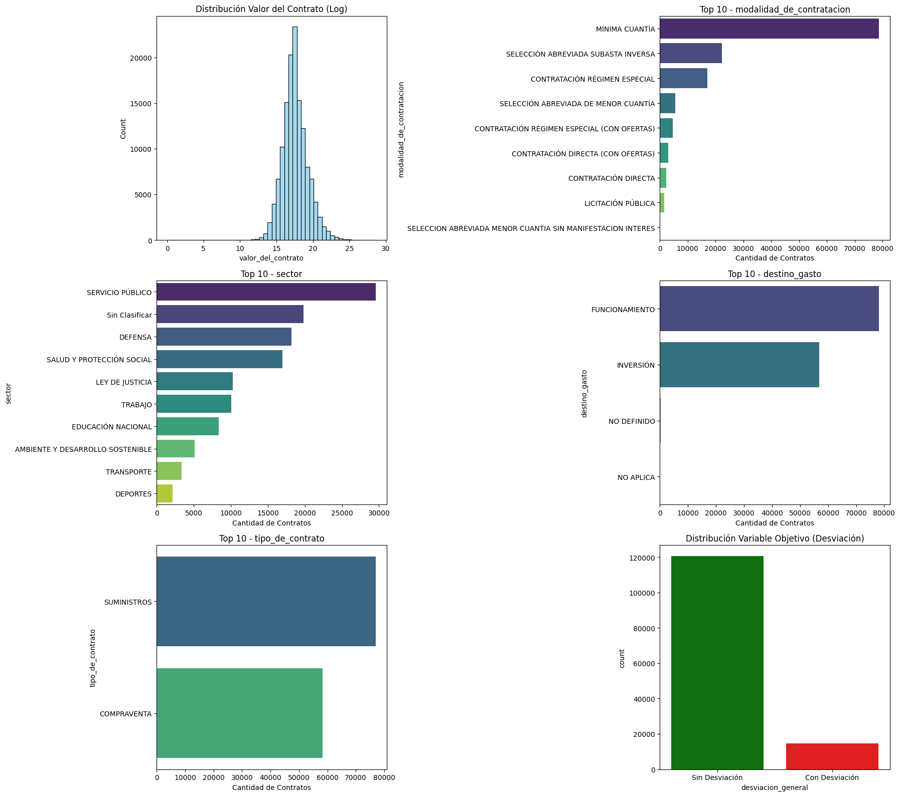

# Reporte de Entendimiento Inicial y Calidad de Datos (EDA)
### 1. Dimensiones y Naturaleza del Dataset
**Estado Inicial:** El dataset extraído de SECOP II contenía originalmente 196,391 registros (contratos) y 36 atributos.

**Tipos de Datos:** El conjunto está compuesto predominantemente por variables categóricas nominales (texto) como modalidad, sector y estado; variables temporales (datetime) para las fechas de firma, inicio y fin; y variables numéricas continuas/discretas para los valores financieros (valor del contrato, valor pagado, adiciones).

**Delimitación del Alcance Temporal:** Al analizar el volumen de firmas anual, se observó que los años 2020 y 2021 estuvieron marcados por regímenes de emergencia (COVID-19), lo que altera las modalidades de contratación. Para asegurar la comparabilidad y la consistencia estadística de la estrategia de supervisión, el análisis se acotó al periodo post-pandemia (2022 - 2025). Tras aplicar todos los filtros de calidad y el corte temporal, el dataset de análisis quedó con **135,300 registros y 42 atributos**.

### 2. Problemas de Calidad de Datos (Data Quality) y Tratamiento
Se implementó un pipeline de limpieza fundamentado en cuatro dimensiones de calidad:

**Completitud (Completeness):** Se detectó un 1.2% de valores nulos en `fecha_de_inicio_del_contrato`. Dado el bajo volumen, se imputó utilizando la `fecha_de_firma`, asumiendo la inmediatez de ejecución legal. Se descartaron 4 registros sin `documento_proveedor`. Los valores categóricos como "NO DEFINIDO" o "NO APLICA" en `sector` se recategorizaron semánticamente como "SIN CLASIFICAR". Las columnas `departamento` y `orden` también contenían la categoría "No Definido", que se preservó como categoría válida renombrándola a "DESCONOCIDO" para no perder esos registros.

**Consistencia (Consistency):** Para evitar la fragmentación de categorías por errores tipográficos (ej. "defensa" vs "Defensa"), se aplicó una vectorización global que transformó todas las variables de texto a mayúsculas y eliminó espacios residuales (strip), excluyendo variables técnicas como identificadores y URLs. Esta estandarización fue crítica para garantizar la correcta evaluación de los estados del contrato en las variables objetivo.

**Conformidad (Conformity):** La columna `duraci_n_del_contrato` presentaba formatos mixtos de texto (días, meses, años). Se aplicó una expresión regular (Regex) para estandarizar todo a una unidad numérica base (días). Además, se eliminaron contratos con `valor_del_contrato` igual o menor a cero por carecer de lógica financiera.

**Lógica Temporal:** Se filtraron registros donde la fecha de fin era estrictamente menor a la fecha de inicio.

### 3. Top 5 de Atributos Clave y Análisis Univariado

Se seleccionaron estos cinco atributos por su impacto directo en la hipótesis de riesgo y supervisión del gasto público:

1. **Valor del Contrato (Numérica):** Es el principal factor de materialidad para control interno. Su distribución presenta una asimetría positiva extrema (ley de potencia): la **mediana es $35,686,945 COP** mientras que la **media asciende a $379,273,577 COP** (ratio 10:1), evidenciando la fuerte influencia de contratos de alto valor. El rango intercuartílico va de $14,022,848 (P25) a $106,157,374 (P75), con un máximo que supera los $2.8 billones COP. Al aplicar una transformación logarítmica, la distribución se normaliza, lo que facilitará su uso en modelos predictivos.

2. **Modalidad de Contratación (Categórica):** Define el rigor legal de la selección. El análisis univariado muestra un predominio absoluto de la **Mínima Cuantía con 78,696 contratos (58.2%)**, seguida de Selección Abreviada Subasta Inversa con 22,379 (16.5%) y Contratación Régimen Especial con 17,127 (12.7%). Las modalidades menos competitivas podrían correlacionarse con mayores desviaciones.

3. **Sector (Categórica):** Permite focalizar la auditoría por ministerio/departamento. **Servicio Público lidera con 29,551 contratos (21.8%)**, seguido de Sin Clasificar con 19,817 (14.6%) y Defensa con 18,192 (13.4%). La elevada proporción de registros sin clasificar es un factor de riesgo para la trazabilidad del gasto.

4. **Destino del Gasto (Categórica):** Fundamental para separar Funcionamiento (gasto recurrente) de Inversión (proyectos). El dataset se divide entre **Funcionamiento con 78,108 contratos (57.7%)** e **Inversión con 56,926 (42.1%)**, con un residual de 263 registros sin definir (0.2%). Esta distribución casi 60/40 permite comparar patrones de desviación entre ambas categorías.

5. **Tipo de Contrato (Categórica):** Divide la naturaleza del bien adquirido. **Suministros representa el 56.9% con 76,986 contratos** y Compraventa el 43.1% con 58,314. La distribución casi equitativa permitirá evaluar si el suministro (que suele tener entregas parciales) presenta más riesgos de adiciones de plazo que la compraventa directa.

### Variable Objetivo (Target):
Finalmente, se construyó una variable unificada de Desviación General (indicador de si el contrato tuvo adiciones de plazo, ejecución presupuestal menor al 95%, o se cerró sin liquidar). La gráfica muestra un desbalance de clases (hay más contratos exitosos que desviados), lo cual es normal en escenarios de riesgo y deberá tenerse en cuenta en las pruebas estadísticas.